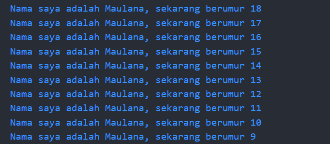

# Pemrograman Mobile

## Tugas Praktikum
### Pengantar Bahasa Pemrograman Dart - Bagian 1

- **Nama:** Maulana Arif Wijaya
- **NIM:** 2141720085
- **Kelas:** TI-3H
- **No Absen:** 16

## Soal 1

### Jawaban

#### Code

#### Hasil

## Soal 2

Mengapa sangat penting untuk memahami bahasa pemrograman Dart sebelum kita menggunakan framework Flutter ? Jelaskan!

### Jawaban

Karena Dart adalah bahasa pemrograman yang digunakan untuk membuat aplikasi Flutter. Jadi, jika kita ingin membuat aplikasi Flutter, kita harus memahami bahasa pemrograman Dart terlebih dahulu.

## Soal 3

Rangkumlah materi dari codelab ini menjadi poin-poin penting yang dapat Anda gunakan untuk membantu proses pengembangan aplikasi mobile menggunakan framework Flutter.

### Jawaban

1. **Dart adalah Bahasa Utama Flutter:**
   - Flutter menggunakan Dart sebagai bahasa pemrograman utama untuk mengembangkan aplikasi.
   - Memahami Dart adalah kunci untuk menjadi seorang pengembang Flutter yang kompeten.

2. **Penggunaan Dart dalam UI dan Logika:**
   - Dart digunakan untuk mengelola logika aplikasi dan membangun antarmuka pengguna (UI) dalam Flutter.
   - Pengembang perlu menguasai Dart untuk mengatur tampilan dan berinteraksi dengan data dalam Flutter.

3. **Dart dan Flutter Saling Terkait:**
   - Flutter SDK dan Dart SDK telah dirancang untuk saling mendukung.
   - Menggunakan Dart dengan baik dapat mengoptimalkan pengembangan aplikasi Flutter.

4. **Penanganan Event dan State:**
   - Dart memungkinkan penggunaan efektif dalam menangani event, state, dan alur program dalam Flutter.
   - Ini penting untuk memahami konsep ini sebelum merancang aplikasi Flutter yang kompleks.

5. **Keamanan Kode dan Null Safety:**
   - Dart mendukung null safety untuk mencegah NullPointerExceptions dan meningkatkan keamanan kode.
   - Menyadari konsep ini membantu dalam menghindari bug yang umum terkait dengan nilai null.
