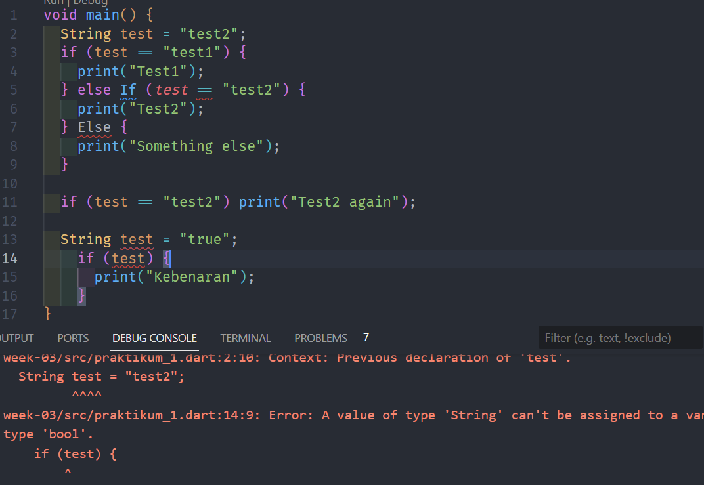

# Pemrograman Mobile
## Pengantar Bahasa Pemrograman Dart - Bagian 3

- **Nama:** Maulana Arif Wijaya
- **NIM:** 2141720085
- **Kelas:** TI-3H
- **No Absen:** 16

### Praktikum 1 : Menerapkan Control Flows ("if/else")

#### Langkah 1

#### Langkah 2

Kode pada langkah pertama tidak bisa dijalankan (error) karena memiliki penulisan sintaks yang salah

##### Langkah 3

Penambahan kode seperti perintah pada langkah 3 tidak menyelesaikan permasalahan pada langkah pertama yaitu error sintaks. Hal ini dikarenakan sintaks pada langkah pertama belum diperbaiki. Selain itu, dari segi aturan penulisan kode, perintah pada langkah 3 akan menimbulkan error meskipun penulisan sintaksnya benar karena perintah tersebut berisikan penulisan nama variabel yang sama dengan variabel yang sudah dideklarasikan sebelumnya yaitu variabel "test".

Dengan memperbaiki penulisan kode sesuai dengan aturan yang ada pada dart, maka kode bisa dijalankan dengan hasil seperti pada gambar di atas 

### Praktikum 2: Menerapkan Perulangan "while" dan "do-while"

#### Langkah 1

#### Langkah 2

Kode yang diberikan pada langkah 1 tidak bisa dijalankan (error) karena variabel "counter" belum dideklarasikan terlebih dahulu

Kode di atas merupakan kode pada langkah 1 yang telah saya perbaiki yaitu dengan mendeklarasi variabel counter sebelum melakukan perulangan dengan "while"

#### Langkah 3

Kode pada langkah 3 dapat dijalankan dan berjalan dengan normal seperti pada gambar di atas

### Praktikum 3

#### Langkah 1

#### Langkah 2

Kode pada langkah 1 tidak bisa dijalankan (error). Hal ini dikarenakan kesalahan penulisan sintaks yaitu variabel "index" tidak dideklarasikan dengan menuliskan tipe data saat inisialisasi.

Setelah diperbaiki dengan deklarasi variabel menggunakan tipe data serta menambahkan operator "++" setelah index, maka program dapat dijalankan dengan output seperti pada gambar di atas

#### Langkah 3

Terjadi error pada program. Error tersebut terletak pada kesalahan penulisan yang tidak sesuai aturan.

Setelah penulisan sintaks diperbaiki, program dapat dijalankan namun tidak mengeluarkan output karena hasil dari logika tersebut mengharuskan perulangan selalu mengarah ke "*break event*"

Ketika operator "||" diganti dengan "&&" maka program akan menegeluarkan output sesuai dengan logika pada kode

### Tugas Praktikum

#### code

### output

