# Pemrograman Mobile

## Tugas Praktikum
### Pengantar Bahasa Pemrograman Dart - Bagian 4

- **Nama:** Maulana Arif Wijaya
- **NIM:** 2141720085
- **Kelas:** TI-3H
- **No Absen:** 16

## Praktikum 1
1. Silakan coba eksekusi (Run) kode pada langkah 1 tersebut. Apa yang terjadi? Jelaskan!
2. Ubah kode pada langkah 1 menjadi variabel final yang mempunyai index = 5 dengan default value = null. Isilah nama dan NIM Anda pada elemen index ke-1 dan ke-2. Lalu print dan capture hasilnya.
Apa yang terjadi ? Jika terjadi error, silakan perbaiki.
### Jawaban
1. tidak ada error yang terjadi, karena semua assert yang ditulis bernilai true.
#### Code
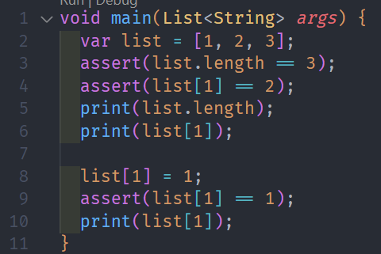

#### Hasil
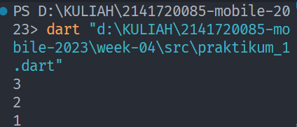

2. terjadi error, karena list tersebut tidak mendefinisikan tipedata apa saja yang dapat diisi pada list.

#### Code
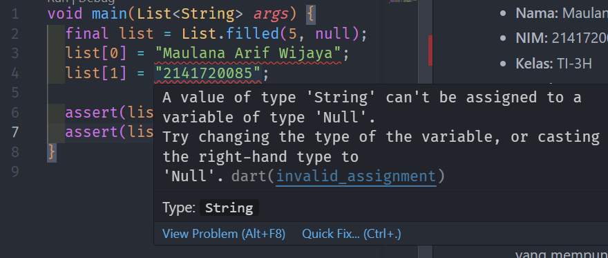

Jika diubah menjadi seperti ini, maka tidak akan terjadi error.

#### Code
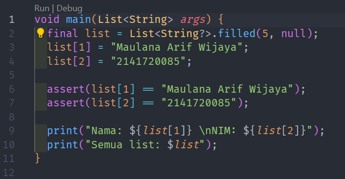

#### Hasil
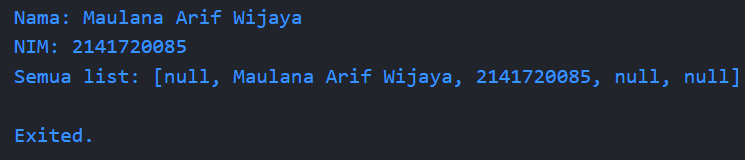

## Praktikum 2

1. Silakan coba eksekusi (Run) kode pada langkah 1 tersebut. Apa yang terjadi? Jelaskan! Lalu perbaiki jika terjadi error.
```dart
var halogens = {'fluorine', 'chlorine', 'bromine', 'iodine', 'astatine'};
print(halogens);
```
2. Tambahkan kode program berikut, lalu coba eksekusi (Run) kode Anda.
```dart
var names1 = <String>{};
Set<String> names2 = {}; // This works, too.
var names3 = {}; // Creates a map, not a set.

print(names1);
print(names2);
print(names3);
```
Apa yang terjadi ? Jika terjadi error, silakan perbaiki namun tetap menggunakan ketiga variabel tersebut. Tambahkan elemen nama dan NIM Anda pada kedua variabel Set tersebut dengan dua fungsi berbeda yaitu .add() dan .addAll(). Untuk variabel Map dihapus, nanti kita coba di praktikum selanjutnya.

### Jawaban
1. Kode pada langkah 1 berfungsi untuk menampilkan himpunan dari elemen halogen yang terdaftar seperti pada kode. Tidak ada error pada kode tersebut sehingga dapat mencetak nilai dengan benar.
#### Hasil
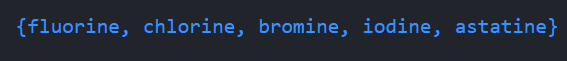

2. Ketika kode tersebut dijalankan, maka tidak akan terjadi error namun kode program hanya mencetak "{}" karena tidak ada nilai yang dimasukkan pada set.

#### Code


#### Hasil
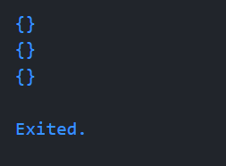

Setelah kode tersebut diisikan elemen, maka akan mencetak nilai yang dimasukkan pada set seperti pada kode berikut.

#### Code

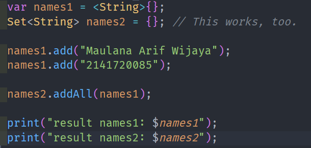

#### Hasil
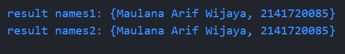

## Praktikum 3

1. Ketik atau salin kode program berikut ke dalam fungsi main().
```dart
var gifts = {
  // Key:    Value
  'first': 'partridge',
  'second': 'turtledoves',
  'fifth': 1
};

var nobleGases = {
  2: 'helium',
  10: 'neon',
  18: 2,
};

print(gifts);
print(nobleGases);
```
2. Silakan coba eksekusi (Run) kode pada langkah 1 tersebut. Apa yang terjadi? Jelaskan! Lalu perbaiki jika terjadi error.

3. Tambahkan kode program berikut, lalu coba eksekusi (Run) kode Anda.

```dart
var mhs1 = Map<String, String>();
gifts['first'] = 'partridge';
gifts['second'] = 'turtledoves';
gifts['fifth'] = 'golden rings';

var mhs2 = Map<int, String>();
nobleGases[2] = 'helium';
nobleGases[10] = 'neon';
nobleGases[18] = 'argon';
```
Apa yang terjadi ? Jika terjadi error, silakan perbaiki.

Tambahkan elemen nama dan NIM Anda pada tiap variabel di atas (gifts, nobleGases, mhs1, dan mhs2).

### Jawaban

1. _menjawab soal nomor 1 dan 2_ Tidak terjadi error pada kode tersebut dan kode dapat dijalankan dengan baik. Berikut adalah code dan hasil eksekusinya
#### Code
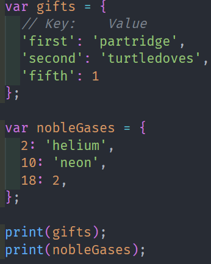

#### Hasil
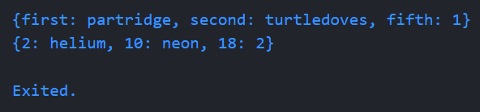

2. _menjawab soal nomor 3_ Ketika kode tersebut dijalankan, maka tidak akan terjadi error dan dapat dieksekusi dengan baik. Hasil eksekusi kode tersebut sama seperti pada latihan sebelumnya karena tidak ada perintah print.

#### Code
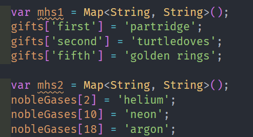

#### Hasil
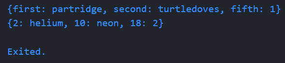

Setelah penambahan data, maka hasil eksekusi kode akan seperti berikut.

#### Code
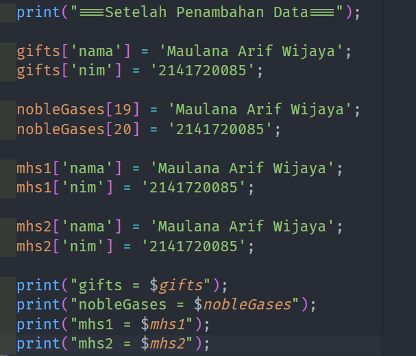

#### Hasil
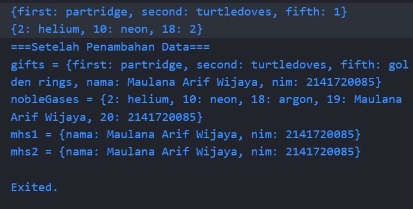


## Praktikum 4

1. Ketik atau salin kode program berikut ke dalam fungsi main().
```dart
var list = [1, 2, 3];
var list2 = [0, ...list];
print(list1);
print(list2);
print(list2.length);
```

2. Silakan coba eksekusi (Run) kode pada langkah 1 tersebut. Apa yang terjadi? Jelaskan! Lalu perbaiki jika terjadi error.

3. Tambahkan kode program berikut, lalu coba eksekusi (Run) kode Anda.
```dart
list1 = [1, 2, null];
print(list1);
var list3 = [0, ...?list1];
print(list3.length);
```
Apa yang terjadi ? Jika terjadi error, silakan perbaiki.

Tambahkan variabel list berisi NIM Anda menggunakan Spread Operators. Dokumentasikan hasilnya dan buat laporannya!

4. Tambahkan kode program berikut, lalu coba eksekusi (Run) kode Anda.

```dart
var nav = ['Home', 'Furniture', 'Plants', if (promoActive) 'Outlet'];
print(nav);
```

Apa yang terjadi ? Jika terjadi error, silakan perbaiki. Tunjukkan hasilnya jika variabel promoActive ketika true dan false.

5. Tambahkan kode program berikut, lalu coba eksekusi (Run) kode Anda.

```dart
var nav2 = ['Home', 'Furniture', 'Plants', if (login case 'Manager') 'Inventory'];
print(nav2);
```

Apa yang terjadi ? Jika terjadi error, silakan perbaiki. Tunjukkan hasilnya jika variabel login mempunyai kondisi lain.

6. Tambahkan kode program berikut, lalu coba eksekusi (Run) kode Anda.

```dart
var listOfInts = [1, 2, 3];
var listOfStrings = ['#0', for (var i in listOfInts) '#$i'];
assert(listOfStrings[1] == '#1');
print(listOfStrings);
```

Apa yang terjadi ? Jika terjadi error, silakan perbaiki. Jelaskan manfaat **Collection For** dan dokumentasikan hasilnya.

### Jawaban

1. _menjawab soal nomor 1 dan 2_ Terdapat kesalahan penulisan pada kode tersebut, yaitu pada variabel list1. Kode tersebut tidak dapat dijalankan karena tidak ada variabel list1 yang didefinisikan sebelumnya. Berikut adalah code dan laporan error-nya

#### Code
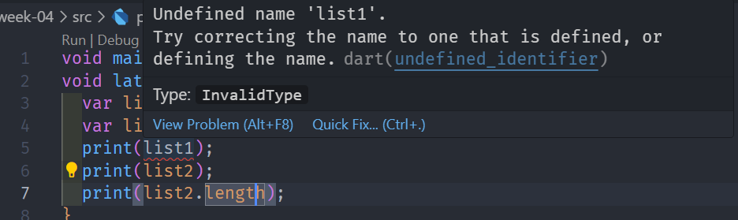

2. Untuk memperbaikinya, maka variabel list1 pada print() harus diganti dengan variabel list yang tersedia yaitu "list". Berikut adalah code dan hasil eksekusinya

#### Code
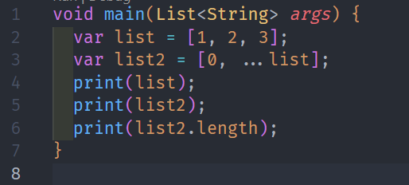

#### Hasil

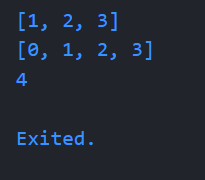

3. Terdapat error sintaks pada kode tersebut karena list1 belum dideklarasikan, sehingga tidak dapat dijalankan. Berikut adalah code dan laporan error-nya

#### Code
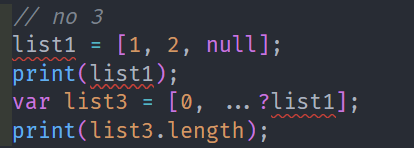

Untuk memperbaikinya, maka harus mendefinisikan terlebih dahulu variabel list1. Berikut adalah code dan hasil eksekusinya

Namun terjadi warning lagi seperti pada code berikut

#### Code
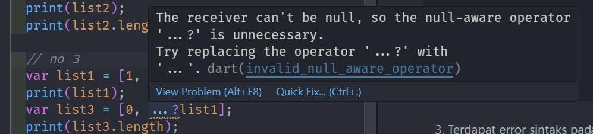

#### Hasil

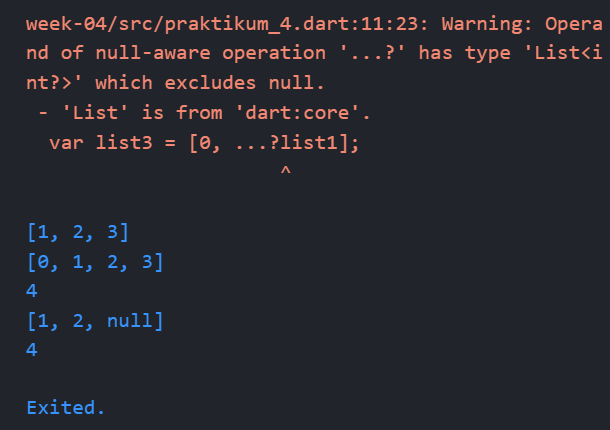

Berikut adalah code dan hasil eksekusinya setelah membuat list dengan spread operator

#### Code
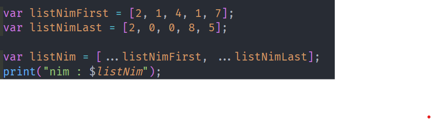

#### Hasil
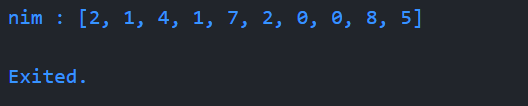

4. Kode tersebut error karena variabel promoActive belum didefinisikan. Berikut adalah code dan laporan error-nya

#### Code
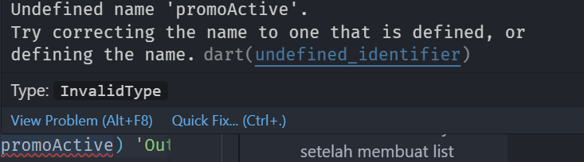

Untuk memperbaikinya, maka harus mendefinisikan terlebih dahulu variabel promoActive. Berikut adalah code dan hasil eksekusinya

#### Code
**TRUE**
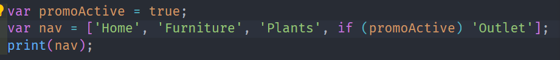
**FALSE**
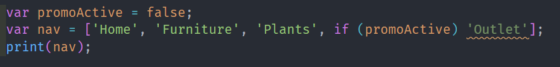


#### Hasil
**TRUE**
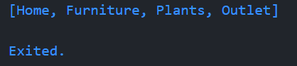
**FALSE**
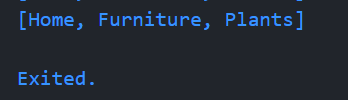


5. Kode tersebut error karena variabel login belum didefinisikan. Berikut adalah code dan laporan error-nya

#### Code
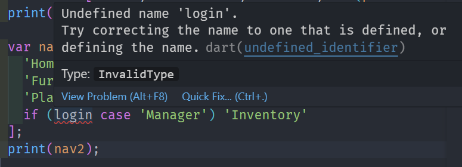

Untuk memperbaikinya, maka harus mendefinisikan terlebih dahulu variabel login. Berikut adalah code dan hasil eksekusinya

#### Code
**TRUE**
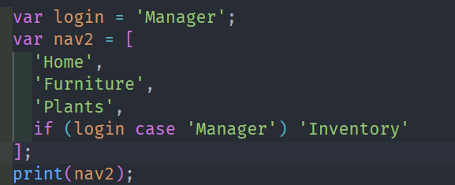
**FALSE**
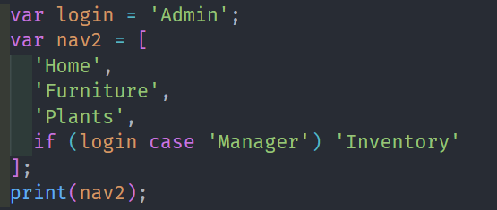

#### Hasil
**TRUE**
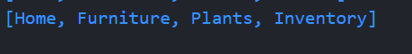
**FALSE**


6. 
#### Code

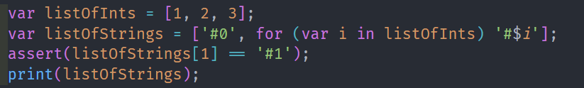


