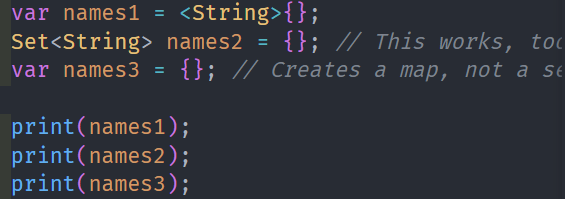

# Pemrograman Mobile

## Tugas Praktikum
### Pengantar Bahasa Pemrograman Dart - Bagian 4

- **Nama:** Maulana Arif Wijaya
- **NIM:** 2141720085
- **Kelas:** TI-3H
- **No Absen:** 16

## Praktikum 1
1. Silakan coba eksekusi (Run) kode pada langkah 1 tersebut. Apa yang terjadi? Jelaskan!
2. Ubah kode pada langkah 1 menjadi variabel final yang mempunyai index = 5 dengan default value = null. Isilah nama dan NIM Anda pada elemen index ke-1 dan ke-2. Lalu print dan capture hasilnya.
Apa yang terjadi ? Jika terjadi error, silakan perbaiki.
### Jawaban
1. tidak ada error yang terjadi, karena semua assert yang ditulis bernilai true.
#### Code


#### Hasil


2. terjadi error, karena list tersebut tidak mendefinisikan tipedata apa saja yang dapat diisi pada list.

#### Code


Jika diubah menjadi seperti ini, maka tidak akan terjadi error.

#### Code


#### Hasil


## Praktikum 2

1. Silakan coba eksekusi (Run) kode pada langkah 1 tersebut. Apa yang terjadi? Jelaskan! Lalu perbaiki jika terjadi error.
```dart
var halogens = {'fluorine', 'chlorine', 'bromine', 'iodine', 'astatine'};
print(halogens);
```
2. Tambahkan kode program berikut, lalu coba eksekusi (Run) kode Anda.
```dart
var names1 = <String>{};
Set<String> names2 = {}; // This works, too.
var names3 = {}; // Creates a map, not a set.

print(names1);
print(names2);
print(names3);
```
Apa yang terjadi ? Jika terjadi error, silakan perbaiki namun tetap menggunakan ketiga variabel tersebut. Tambahkan elemen nama dan NIM Anda pada kedua variabel Set tersebut dengan dua fungsi berbeda yaitu .add() dan .addAll(). Untuk variabel Map dihapus, nanti kita coba di praktikum selanjutnya.

### Jawaban
1. Kode pada langkah 1 berfungsi untuk menampilkan himpunan dari elemen halogen yang terdaftar seperti pada kode. Tidak ada error pada kode tersebut sehingga dapat mencetak nilai dengan benar.
#### Hasil


2. Ketika kode tersebut dijalankan, maka tidak akan terjadi error namun kode program hanya mencetak "{}" karena tidak ada nilai yang dimasukkan pada set.

#### Code


#### Hasil


Setelah kode tersebut diisikan elemen, maka akan mencetak nilai yang dimasukkan pada set seperti pada kode berikut.

#### Code


#### Hasil


## Praktikum 3

1. Ketik atau salin kode program berikut ke dalam fungsi main().
```dart
var gifts = {
  // Key:    Value
  'first': 'partridge',
  'second': 'turtledoves',
  'fifth': 1
};

var nobleGases = {
  2: 'helium',
  10: 'neon',
  18: 2,
};

print(gifts);
print(nobleGases);
```
2. Silakan coba eksekusi (Run) kode pada langkah 1 tersebut. Apa yang terjadi? Jelaskan! Lalu perbaiki jika terjadi error.

3. Tambahkan kode program berikut, lalu coba eksekusi (Run) kode Anda.

```dart
var mhs1 = Map<String, String>();
gifts['first'] = 'partridge';
gifts['second'] = 'turtledoves';
gifts['fifth'] = 'golden rings';

var mhs2 = Map<int, String>();
nobleGases[2] = 'helium';
nobleGases[10] = 'neon';
nobleGases[18] = 'argon';
```
Apa yang terjadi ? Jika terjadi error, silakan perbaiki.

Tambahkan elemen nama dan NIM Anda pada tiap variabel di atas (gifts, nobleGases, mhs1, dan mhs2).

### Jawaban

1. _menjawab soal nomor 1 dan 2_ Tidak terjadi error pada kode tersebut dan kode dapat dijalankan dengan baik. Berikut adalah code dan hasil eksekusinya
#### Code


#### Hasil


2. _menjawab soal nomor 3_ Ketika kode tersebut dijalankan, maka tidak akan terjadi error dan dapat dieksekusi dengan baik. Hasil eksekusi kode tersebut sama seperti pada latihan sebelumnya karena tidak ada perintah print.

#### Code


#### Hasil


Setelah penambahan data, maka hasil eksekusi kode akan seperti berikut.

#### Code


#### Hasil


## Praktikum 4

1. Ketik atau salin kode program berikut ke dalam fungsi main().
```dart
var list = [1, 2, 3];
var list2 = [0, ...list];
print(list1);
print(list2);
print(list2.length);
```

2. Silakan coba eksekusi (Run) kode pada langkah 1 tersebut. Apa yang terjadi? Jelaskan! Lalu perbaiki jika terjadi error.

3. Tambahkan kode program berikut, lalu coba eksekusi (Run) kode Anda.
```dart
list1 = [1, 2, null];
print(list1);
var list3 = [0, ...?list1];
print(list3.length);
```
Apa yang terjadi ? Jika terjadi error, silakan perbaiki.

Tambahkan variabel list berisi NIM Anda menggunakan Spread Operators. Dokumentasikan hasilnya dan buat laporannya!

4. Tambahkan kode program berikut, lalu coba eksekusi (Run) kode Anda.

```dart
var nav = ['Home', 'Furniture', 'Plants', if (promoActive) 'Outlet'];
print(nav);
```

Apa yang terjadi ? Jika terjadi error, silakan perbaiki. Tunjukkan hasilnya jika variabel promoActive ketika true dan false.

5. Tambahkan kode program berikut, lalu coba eksekusi (Run) kode Anda.

```dart
var nav2 = ['Home', 'Furniture', 'Plants', if (login case 'Manager') 'Inventory'];
print(nav2);
```

Apa yang terjadi ? Jika terjadi error, silakan perbaiki. Tunjukkan hasilnya jika variabel login mempunyai kondisi lain.

6. Tambahkan kode program berikut, lalu coba eksekusi (Run) kode Anda.

```dart
var listOfInts = [1, 2, 3];
var listOfStrings = ['#0', for (var i in listOfInts) '#$i'];
assert(listOfStrings[1] == '#1');
print(listOfStrings);
```

Apa yang terjadi ? Jika terjadi error, silakan perbaiki. Jelaskan manfaat **Collection For** dan dokumentasikan hasilnya.

### Jawaban

1. _menjawab soal nomor 1 dan 2_ Terdapat kesalahan penulisan pada kode tersebut, yaitu pada variabel list1. Kode tersebut tidak dapat dijalankan karena tidak ada variabel list1 yang didefinisikan sebelumnya. Berikut adalah code dan laporan error-nya

#### Code


2. Untuk memperbaikinya, maka variabel list1 pada print() harus diganti dengan variabel list yang tersedia yaitu "list". Berikut adalah code dan hasil eksekusinya

#### Code


#### Hasil


3. Terdapat error sintaks pada kode tersebut karena list1 belum dideklarasikan, sehingga tidak dapat dijalankan. Berikut adalah code dan laporan error-nya

#### Code


Untuk memperbaikinya, maka harus mendefinisikan terlebih dahulu variabel list1. Berikut adalah code dan hasil eksekusinya

Namun terjadi warning lagi seperti pada code berikut

#### Code


#### Hasil


Berikut adalah code dan hasil eksekusinya setelah membuat list dengan spread operator

#### Code


#### Hasil


4. Kode tersebut error karena variabel promoActive belum didefinisikan. Berikut adalah code dan laporan error-nya

#### Code


Untuk memperbaikinya, maka harus mendefinisikan terlebih dahulu variabel promoActive. Berikut adalah code dan hasil eksekusinya

#### Code

**TRUE**


**FALSE**


#### Hasil

**TRUE**


**FALSE**


5. Kode tersebut error karena variabel login belum didefinisikan. Berikut adalah code dan laporan error-nya

#### Code


Untuk memperbaikinya, maka harus mendefinisikan terlebih dahulu variabel login. Berikut adalah code dan hasil eksekusinya

#### Code

**TRUE**


**FALSE**


#### Hasil

**TRUE**


**FALSE**


6. 
#### Code


#### Hasil


## Praktikum 5

1. Ketik atau salin kode program berikut ke dalam fungsi main().
```dart
void main() {
  var record = ('first', a:2,b:true,'last')
  print(record);
}
```

2. Silakan coba eksekusi (Run) kode pada langkah 1 tersebut. Apa yang terjadi? Jelaskan! Lalu perbaiki jika terjadi error.

#### Output


**Penjelasan**

Kode tersebut dapat berjalan dengan lancar. Hasil dari eksekusi kode tersebut adalah sebuah list yang berisi elemen-elemen yang ditulis pada kode tersebut.

3. Tambahkan kode program berikut, lalu coba eksekusi (Run) kode Anda.
```dart
(int,int) tukar((int,int) record){
  var (a,b) = record;
  return (b,a);
}
```

#### Code


#### Output


4. Tambahkan kode program berikut, lalu coba eksekusi (Run) kode Anda.
```dart
(String,int) mahasiswa;
print(mahasiswa);
```

#### Output


**Penjelasan**

Kode tersebut error karena variabel mahasiswa belum didefinisikan. Untuk memperbaikinya, maka harus mendefinisikan terlebih dahulu variabel mahasiswa. Berikut adalah code dan hasil eksekusinya

#### Fixed


#### Output


5. Tambahkan kode program berikut, lalu coba eksekusi (Run) kode Anda.
```dart
var mahasiswa2 = ('first', a: 2, b: true, 'last');

print(mahasiswa2.$1); // Prints 'first'
print(mahasiswa2.a); // Prints 2
print(mahasiswa2.b); // Prints true
print(mahasiswa2.$2); // Prints 'last'
```

## Tugas Praktikum

1. Jelaskan yang dimaksud functions dalam bahasa dart

    **Jawaban**

    Functions adalah sebuah blok kode yang dapat digunakan kembali. Blok kode tersebut dapat dijalankan dengan cara memanggilnya dari tempat lain dalam program. Sebuah fungsi dapat memiliki parameter yang berarti fungsi tersebut dapat menerima input dari tempat lain dalam program. Sebuah fungsi dapat mengembalikan output.

2. Jelaskan jenis-jenis parameter di Functions beserta contoh sintaksnya!

    **Jawaban**

    1. **Positional Parameters (Parameter Posisi):**
      Parameter posisi adalah parameter yang nilainya diterima berdasarkan posisinya dalam daftar parameter fungsi. Ini adalah jenis parameter yang paling umum digunakan.

        Contoh:
        ```dart
        void greet(String name, int age) {
          print("Hello, $name! You are $age years old.");
        }
        ```

        Panggilan fungsi:
        ```dart
        greet("Alice", 30);
        ```

    2. **Named Parameters (Parameter Bernama):**

      Parameter bernama adalah parameter yang memiliki nama yang ditentukan dan diberi nilai menggunakan sintaks `namaParameter: nilai`. Hal ini memungkinkan Anda untuk mengabaikan urutan parameter saat memanggil fungsi.

      Contoh:
      ```dart
      void greet({String name, int age}) {
        print("Hello, $name! You are $age years old.");
      }
      ```

      Panggilan fungsi:
      ```dart
      greet(name: "Bob", age: 25);
      ```

    3. **Default Parameters (Parameter Default):**
      Parameter default adalah parameter yang memiliki nilai default yang akan digunakan jika parameter tersebut tidak diberikan nilai saat memanggil fungsi.

      Contoh:
      ```dart
      void greet(String name, {int age = 30}) {
        print("Hello, $name! You are $age years old.");
      }
      ```

      Panggilan fungsi tanpa memberikan nilai untuk `age`:
      ```dart
      greet("Charlie"); // age akan menggunakan nilai default 30
      ```

    4. **Required Parameters (Parameter Wajib):**
      Dart 2.12 ke atas memungkinkan Anda untuk menandai parameter sebagai wajib (required). Ini berarti parameter tersebut harus diberikan nilai saat memanggil fungsi.

      Contoh:
      ```dart
      void greet(String name, {required int age}) {
        print("Hello, $name! You are $age years old.");
      }
      ```

      Panggilan fungsi dengan parameter wajib:
      ```dart
      greet("David", age: 40);
      ```

      Panggilan fungsi tanpa memberikan nilai untuk `age` akan menyebabkan kesalahan.

3. Jelaskan maksud Functions sebagai first-class objects beserta contoh sintaknya!

    **Jawaban**

    Dart mendukung fungsi sebagai first-class objects, yang berarti fungsi dapat disimpan dalam variabel atau struktur data seperti struktur data lainnya. Anda dapat mengembalikan fungsi dari fungsi lain, dan juga dapat meneruskan fungsi sebagai argumen ke fungsi lain.

    Contoh:
    ```dart
    void main() {
      // Fungsi yang disimpan dalam variabel
      var sayHello = (String name) => print("Hello, $name!");

      // Fungsi yang menerima fungsi lain sebagai argumen
      void greet(String name, Function sayHello) {
        sayHello(name);
      }

      // Fungsi yang mengembalikan fungsi lain
      Function talk() {
        return (String subject) => print("Talking about $subject");
      }

      // Memanggil fungsi yang disimpan dalam variabel
      sayHello("Alice");

      // Memanggil fungsi yang menerima fungsi lain sebagai argumen
      greet("Bob", sayHello);

      // Memanggil fungsi yang mengembalikan fungsi lain
      var talkAbout = talk();
      talkAbout("Dart");
    }
    ```

4. Apa itu Anonymous Functions? Jelaskan dan berikan contohnya!

    **Jawaban**

    Anonymous functions, juga dikenal sebagai lambda functions atau closures, adalah fungsi tanpa nama yang digunakan untuk mendefinisikan dan menjalankan kode di tempat yang sama. Mereka berguna dalam situasi di mana Anda perlu mengirimkan fungsi sebagai argumen ke fungsi lain atau membuat fungsi sederhana tanpa memberikan nama. Contoh penggunaannya dalam Dart:

    ```dart
    var greet = () {
      print("Hello, World!");
    };

    var add = (int a, int b) => a + b;

    var numbers = [1, 2, 3, 4, 5];
    numbers.forEach((number) {
      print("Angka: $number");
    });
    ```

5. Jelaskan perbedaan Lexical scope dan Lexical closures! Berikan contohnya!

    **Jawaban**

    **Lexical Scope (Lingkup Leksikal):**
    Lexical scope mengacu pada cara variabel dan fungsi di dalam sebuah blok kode atau fungsi hanya dapat diakses di dalam blok tersebut atau di dalam fungsi yang mengelilinginya. Ini berarti variabel yang dideklarasikan di dalam suatu fungsi hanya dapat diakses di dalam fungsi tersebut dan tidak dapat diakses dari luar fungsi tersebut.

    Contoh:
    ```dart
    void outerFunction() {
      int x = 10;
      void innerFunction() {
        print(x); // Variabel x dapat diakses karena berada dalam lingkup leksikal outerFunction.
      }
      innerFunction();
    }

    outerFunction();
    ```

    **Lexical Closures (Penutupan Leksikal):**
    Lexical closures adalah konsep di mana sebuah fungsi yang dideklarasikan di dalam fungsi lain dapat "mengingat" dan mengakses variabel-variabel yang ada dalam lingkup leksikal dari fungsi induknya, bahkan setelah fungsi induk tersebut selesai dieksekusi. Dengan kata lain, fungsi dalam closure dapat mengakses variabel-variabel dari lingkup di mana mereka dibuat.

    Contoh:
    ```dart
    Function makeCounter() {
      int count = 0;
      return () {
        count++;
        print(count);
      };
    }

    final counter = makeCounter();
    counter(); // Output: 1
    counter(); // Output: 2
    ```

    Pada contoh di atas, `makeCounter` adalah fungsi yang mengembalikan fungsi lain sebagai hasilnya. Fungsi yang dikembalikan ini adalah closure yang dapat mengakses dan memodifikasi variabel `count` dari lingkup leksikal `makeCounter`. Ini menghasilkan perilaku seperti penjumlahan yang terus menerus.

6. Jelaskan dengan contoh cara membuat return multiple value di Functions!

    **Jawaban**

    Cara untuk membuat return multiple valud di function adalah dengan menggunakan `Record`. Contoh:

    ```dart
    (String, int) getPerson() {
      var name = "Alice";
      var age = 30;
      return (name, age);
    }
    ```


