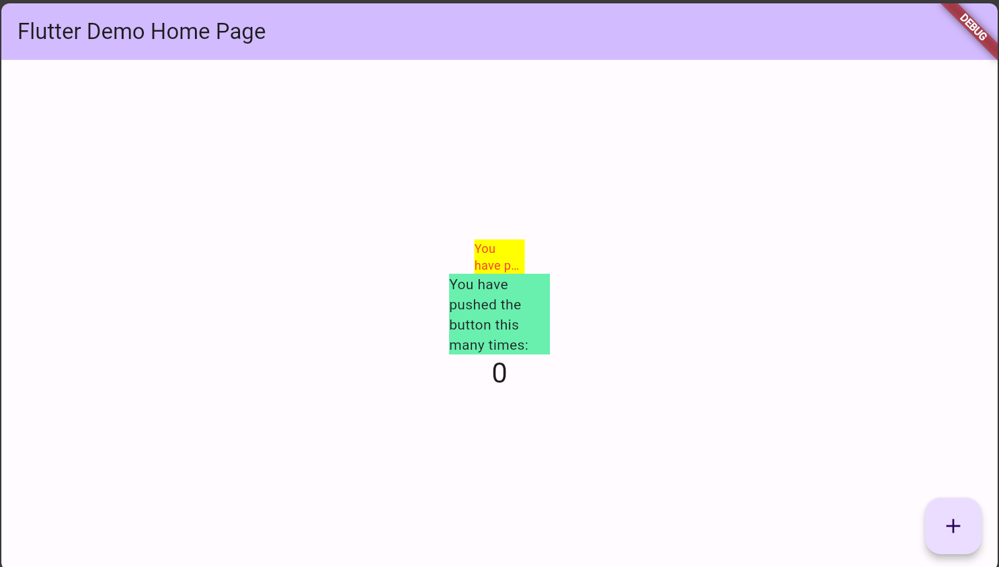

1. Selesaikan Praktikum tersebut, lalu dokumentasikan dan push ke repository Anda
berupa screenshot hasil pekerjaan beserta penjelasannya di file README.md!
2. Jelaskan maksud dari langkah 2 pada praktikum tersebut!
3. Jelaskan maksud dari langkah 5 pada praktikum tersebut!
4. Pada langkah 6 terdapat dua widget yang ditambahkan, jelaskan fungsi dan perbedaannya!
5. Jelaskan maksud dari tiap parameter yang ada di dalam plugin auto_size_text berdasarkan tautan pada dokumentasi ini !
6. Kumpulkan laporan praktikum Anda berupa link repository GitHub ke spreadsheet yang telah disediakan!

## Jawaban

1. Screenshot hasil pekerjaan beserta penjelasannya di file README.md!

2. Maksud dari langkah 2 pada praktikum tersebut adalah untuk menambahkan package auto_size_text pada pubspec.yaml

3. Maksud dari langkah 5 pada praktikum tersebut adalah untuk menambahkan widget AutoSizeText pada body

4. Pada langkah 6 terdapat dua widget yang ditambahkan, yaitu AutoSizeText dan AutoSizeGroup. AutoSizeText digunakan untuk menampilkan text yang akan diatur ukurannya sesuai dengan ukuran layar. Sedangkan AutoSizeGroup digunakan untuk mengatur ukuran text yang akan ditampilkan.

5. Parameter yang ada di dalam plugin auto_size_text berdasarkan tautan pada dokumentasi ini adalah sebagai berikut:

- presetFontSizes: untuk mengatur ukuran font yang akan ditampilkan
- minFontSize: untuk mengatur ukuran font minimum yang akan ditampilkan
- maxFontSize: untuk mengatur ukuran font maksimum yang akan ditampilkan
- group: untuk mengatur group dari text yang akan ditampilkan
- style: untuk mengatur style dari text yang akan ditampilkan
- textAlign: untuk mengatur posisi text yang akan ditampilkan
- maxLines: untuk mengatur jumlah baris maksimum dari text yang akan ditampilkan
- overflow: untuk mengatur overflow dari text yang akan ditampilkan
- wrapWords: untuk mengatur apakah text yang akan ditampilkan akan diwrap atau tidak
- stepGranularity: untuk mengatur step dari text yang akan ditampilkan
- textDirection: untuk mengatur arah text yang akan ditampilkan
- textKey: untuk mengatur key dari text yang akan ditampilkan
- textScaleFactor: untuk mengatur text scale factor dari text yang akan ditampilkan
- textWidthBasis: untuk mengatur text width basis dari text yang akan ditampilkan
- textHeightBehavior: untuk mengatur text height behavior dari text yang akan ditampilkan
