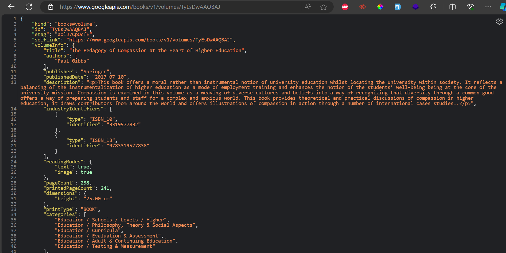
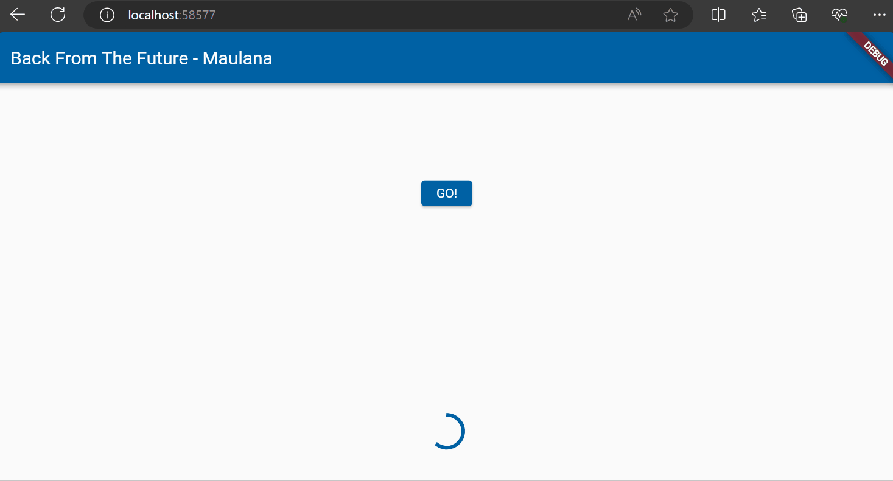
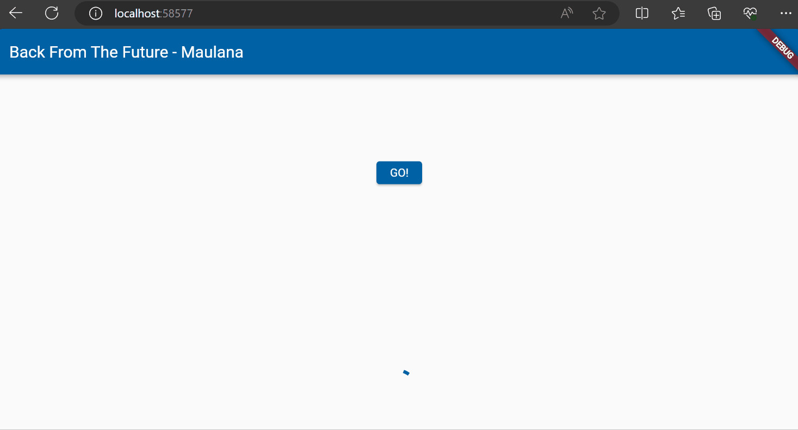

# Pertemuan 12

## Praktikum 1

### Soal 1 

Tambahkan nama panggilan Anda pada `title` app sebagai identitas hasil pekerjaan Anda.

### Soal 2

### Soal 3

1. Jelaskan maksud kode langkah 5 tersebut terkait `substring` dan `catchError`!

    `Substring` adalah method yang digunakan untuk membatasi value dari `string` sehingga yang tampil hanyalah karakter dari 0 hingga 450 saja

    `catchError` merupakan method untuk menangkap error yang terjadi pada program yang terdapat pada fungsi `then()`

2. Jalankan Aplikasi

## Praktikum 2

### Soal 4

1. Jelaskan maksud kode langkah 1 dan 2 tersebut!

    Langkah 1 adalah langkah untuk membuat kode berupa `function` yang menghasilkan suatu nilai (1,2,3) namun dengan jeda waktu selama 3 detik. Hal ini disebabkan karena penggunaan `Future.delayed()`

2. Jalankan Aplikasi

## Praktikum 3

### Soal 5

1. Jelaskan maksud kode langkah 2 tersebut!

    Kode tersebut bertujuan untuk mengembalikan nilai 42 dengan jeda 5 detik dengan menggunakan completer

2. Jalankan Aplikasi

