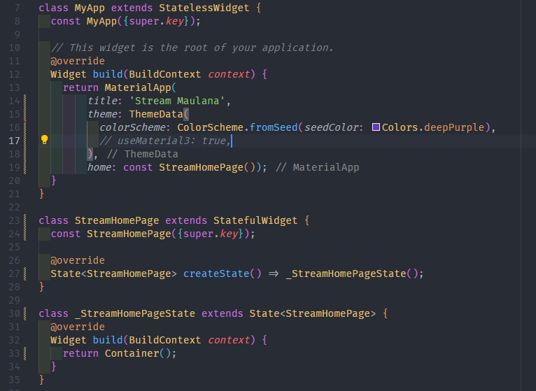
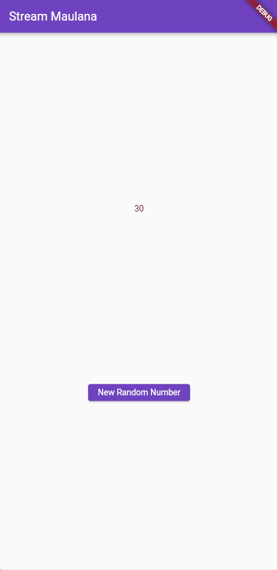

# Week 13

## Praktikum 1

### Soal 1

1. Ubah title

    

### Soal 2

1. Tambahkan 5 warna lainnya sesuai keinginan Anda pada variabel `colors` tersebut.

    

### Soal 3

1. Jelaskan fungsi keyword `yield*` pada kode tersebut!

    `yield*` digunakan untuk mengembalikan nilai dari fungsi generator yang dipanggil.

2. Apa maksud isi perintah kode tersebut?

    Maksud dari kode tersebut adalah untuk mengembalikan nilai dari fungsi generator yang dipanggil.
    

### Soal 4

1. Capture hasil praktikum Anda berupa GIF dan lampirkan di README.

    

### Soal 5

1. Jelaskan perbedaan menggunakan `listen` dan `await for` (langkah 9) !

    Keduanya sama-sama digunakan untuk mendapatkan data dari stream, namun `await for` digunakan untuk mendapatkan semua data dari stream, sedangkan `listen` digunakan untuk mendapatkan data dari stream secara berulang.

### Soal 6

1. Jelaskan maksud kode langkah 8 dan 10 tersebut!

    kode langkah 8 digunakan untuk mendapatkan data dari stream `NumberStream()` dengan menggunakan controller.

    kode langkah 10 digunakan untuk memberi nilai pada stream dengan menggunakan nilai acak dibawah 10.

2. Capture hasil praktikum Anda berupa GIF dan lampirkan di README

    

### Soal 7

1. Jelaskan maksud kode langkah 13 sampai 15 tersebut!

    - Langkah 13 digunakan untuk menambahkan error pada stream yang bertujuan untuk melakukan penanganan error pada stream.

    - Langkah 15 digunakan untuk mengaktifkan error pada stream.

2. Kembalikan kode seperti semula pada Langkah 15, comment `addError()` agar Anda dapat melanjutkan ke praktikum 3 berikutnya.

    

### Soal 8

1. Jelaskan maksud kode langkah 1-3 tersebut!

    langkah - langkah tersebut merupakan langkah untuk membuat stream dengan menggunakan `transform` serta memberikan handling pada setiap kondisi yang terjadi pada stream.

2. Capture hasil praktikum Anda berupa GIF dan lampirkan di README.
  
      

### Soal 9

1. Jelaskan maksud kode langkah 2, 6 dan 8 tersebut!

    - Langkah 2 digunakan untuk mengisi nilai pada subscription sehingga dapat memperoleh stream dari `NumberStream()`.

    - Langkah 6 digunakan untuk menghentikan subscription sehingga tidak memperoleh stream dari `NumberStream()`.

    - Langkah 8 digunakan untuk melakukan pemeriksaan error `error handling` sehingga akan melakukan print -1 ketika stream terlah ditutup.

2. Capture hasil praktikum Anda berupa GIF dan lampirkan di README.

    

